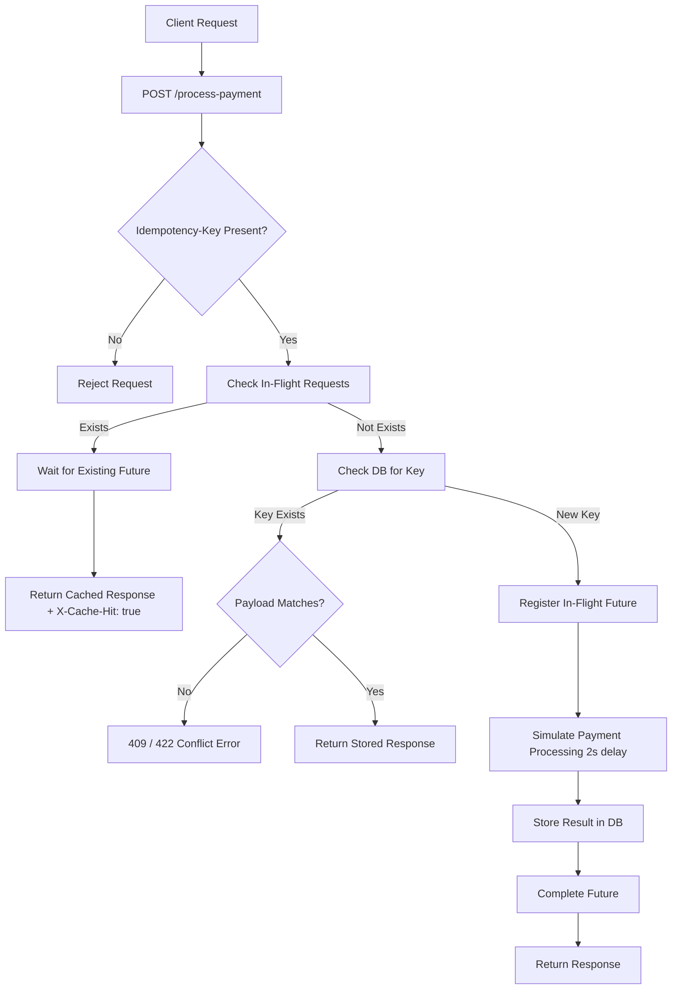

# Idempotency Gateway
---

## Overview

The **Idempotency Gateway** is a backend service built with **Java**, **Spring Boot**, and **PostgreSQL** that ensures reliable payment processing by preventing duplicate charges caused by network retries.

Every payment request carrying the same `Idempotency-Key` is processed **exactly once** — even under concurrent or repeated submissions.

---

## Features

- Idempotent payment processing via `Idempotency-Key` header
- Protection against duplicate charges on retries
- Replay of previous responses for repeated requests
- Payload mismatch detection (security safeguard)
- Concurrency-safe request handling
- PostgreSQL-backed persistence layer
- Input validation with structured error responses
- Cache-hit detection via response headers
- TTL-based idempotency key expiration (24 hours)

---

## Architecture



---

## API Reference

### `POST /process-payment`

Submits a payment request. The `Idempotency-Key` header controls deduplication.

**Headers**

| Header            | Required | Description                    |
|-------------------|------|--------------------------------|
| `Idempotency-Key` | Yes | A unique string per transaction |
| `Content-Type`    | Yes | `application/json`             |

**Request Body**

```json
{
  "amount": 100,
  "currency": "GHS"
}
```

---

### Response Scenarios

#### First Request — `201 Created`

```json
{
  "message": "Charged 100 GHS"
}
```

#### Duplicate Request (same key + same payload) — `201 Created`

Returns the cached response. Includes a cache-hit indicator header:

```
X-Cache-Hit: true
```

```json
{
  "message": "Charged 100 GHS"
}
```

#### Payload Mismatch (same key + different payload) — `409 Conflict`

```json
{
  "error": "Idempotency key already used for a different request body."
}
```

#### Validation Error — `400 Bad Request`

```json
{
  "amount": "Amount is required",
  "currency": "Currency is required"
}
```

---

## Database Schema

**Table:** `idempotency_records`

| Column            | Type        | Description                         |
|-------------------|-------------|-------------------------------------|
| `id`              | `bigint`    | Primary key                         |
| `idempotency_key` | `varchar`   | Unique request identifier           |
| `payload_hash`    | `varchar`   | SHA hash of the request body        |
| `status`          | `enum`      | `PROCESSING` / `COMPLETED` / `FAILED` |
| `response_body`   | `text`      | Stored response payload             |
| `status_code`     | `int`       | HTTP status code of the response    |
| `created_at`      | `timestamp` | Record creation time                |
| `updated_at`      | `timestamp` | Last modification time              |
| `expires_at`      | `timestamp` | TTL expiration (24h from creation)  |

---

## Design Decisions

### Idempotency Key Strategy
Each request must carry a unique `Idempotency-Key` header. This key is the primary mechanism for detecting retries and preventing duplicate processing.

### Payload Hashing
The request body is hashed and stored alongside the key. On retry, hashes are compared — a mismatch triggers a `409 Conflict` to guard against accidental or malicious key reuse.

### Database as Source of Truth
PostgreSQL stores all processed requests and their responses, providing durability across service restarts and horizontal scaling.

### Concurrency Handling
In-flight request tracking ensures that simultaneous requests sharing the same key return consistent results without triggering double processing.

### TTL / Key Expiration
Each record carries an `expires_at` timestamp set 24 hours from creation. Expired keys are treated as new, preventing database bloat and stale key reuse.

---

## Tech Stack

| Layer        | Technology          |
|--------------|---------------------|
| Language     | Java 21             |
| Framework    | Spring Boot 4       |
| Web          | Spring Web (MVC)    |
| Persistence  | Spring Data JPA     |
| ORM          | Hibernate           |
| Database     | PostgreSQL          |
| Build Tool   | Maven               |

---

## Getting Started

### 1. Clone the Repository

```bash
git clone <your-repo-url>
cd Idempotency-Gateway
```

### 2. Set Up PostgreSQL

```sql
CREATE DATABASE idempotency_gateway;

CREATE USER idempotency_user WITH PASSWORD 'your_password';
GRANT ALL PRIVILEGES ON DATABASE idempotency_gateway TO idempotency_user;
```

### 3. Configure `application.properties`

```properties
spring.datasource.url=jdbc:postgresql://localhost:5432/idempotency_gateway
spring.datasource.username=idempotency_user
spring.datasource.password=your_password

spring.jpa.hibernate.ddl-auto=create
spring.jpa.show-sql=true
```

### 4. Run the Application

```bash
mvn spring-boot:run
```

The service starts on `http://localhost:8080`.

---

## Testing with cURL

**First request:**

```bash
curl -X POST http://localhost:8080/process-payment \
  -H "Idempotency-Key: payment-001" \
  -H "Content-Type: application/json" \
  -d '{"amount": 100, "currency": "GHS"}'
```

**Retry (same command):** Returns the cached `201` response with `X-Cache-Hit: true`.

**Payload mismatch:**

```bash
curl -X POST http://localhost:8080/process-payment \
  -H "Idempotency-Key: payment-001" \
  -H "Content-Type: application/json" \
  -d '{"amount": 200, "currency": "USD"}'
```

Returns `409 Conflict`.

---