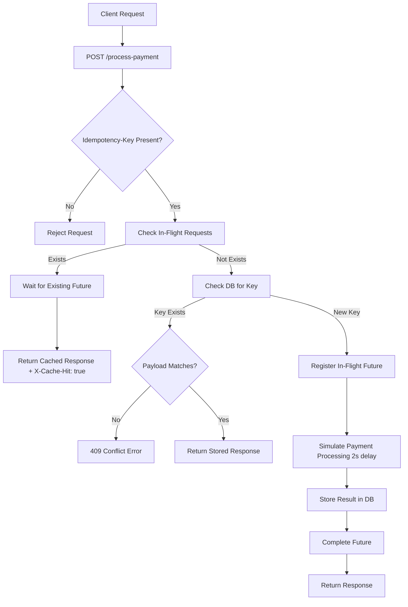

# Idempotency Gateway — Pay Once Protocol

---
## Overview

The **Idempotency Gateway** implements an idempotency layer for payment processing, ensuring that a payment request is processed **exactly once** — even when the client retries due to network failures, timeouts, duplicate submissions, or concurrent requests.

The system combines:

- **Idempotency Keys** — unique per-transaction identifiers
- **Payload Hash Validation** — SHA-256 verification of request bodies
- **PostgreSQL Persistence** — durable storage of processed requests
- **In-Memory Request Coordination** — race condition prevention via `ConcurrentHashMap`

A request sharing the same idempotency key and payload receives the previously computed response instead of triggering another payment execution.

---

## Architecture



---

## Component Overview

```
Client
   │
   ▼
PaymentController
   │
   ▼
IdempotencyService
   │
   ├── PayloadHashUtil          →  Generates SHA-256 hash of request body
   │
   ├── RequestCoordinator       →  Coordinates in-flight requests
   │
   ├── PaymentService           →  Simulates payment processing
   │
   └── IdempotencyRepository
           │
           ▼
      PostgreSQL
```

---

## Tech Stack

| Layer        | Technology          |
|--------------|---------------------|
| Language     | Java 21             |
| Framework    | Spring Boot         |
| Persistence  | Spring Data JPA     |
| Database     | PostgreSQL          |
| Build Tool   | Maven               |
| Container    | Docker + Compose    |
| Utilities    | Lombok              |

---

## Getting Started

### Prerequisites

- Java 21
- Maven
- Docker & Docker Compose

### 1. Clone the Repository

```bash
git clone https://github.com/your-username/idempotency-gateway.git
cd idempotency-gateway
```

### 2. Run Locally

Start PostgreSQL:

```bash
docker compose up -d postgres
```

Run the application:

```bash
./mvnw spring-boot:run
```

The service starts at `http://localhost:8080`.

### 3. Run with Docker (Full Stack)

```bash
# Build containers
docker compose build

# Start all containers
docker compose up -d

# Verify running containers
docker ps

# Stop containers
docker compose down
```

---

## API Reference

### `POST /process-payment`

**Required Headers**

| Header            | Value              |
|-------------------|--------------------|
| `Idempotency-Key` | `payment-001`      |
| `Content-Type`    | `application/json` |

**Request Body**

```json
{
  "amount": 100,
  "currency": "GHS"
}
```

---

### Response Scenarios

#### ✅ First Request — `201 Created`

```json
{
  "message": "Charged 100 GHS"
}
```

#### 🔁 Duplicate Request (same key + same payload) — `201 Created`

Response header:

```
X-Cache-Hit: true
```

```json
{
  "message": "Charged 100 GHS"
}
```

#### ❌ Payload Mismatch (same key + different payload) — `409 Conflict`

```json
{
  "error": "Idempotency key already used for a different request body."
}
```

#### ❌ Validation Failure — `400 Bad Request`

```json
{
  "amount": "Amount is required",
  "currency": "Currency is required"
}
```

#### ❌ Missing Idempotency Header — `400 Bad Request`

```json
{
  "Idempotency-Key": "Idempotency-Key header is required"
}
```

---

## Database Schema

**Table:** `idempotency_records`

| Column            | Type        | Description                            |
|-------------------|-------------|----------------------------------------|
| `id`              | `bigint`    | Primary key                            |
| `idempotency_key` | `varchar`   | Unique request identifier              |
| `payload_hash`    | `varchar`   | SHA-256 hash of the request body       |
| `status`          | `enum`      | `PROCESSING` / `COMPLETED` / `FAILED`  |
| `response_body`   | `text`      | Stored response payload                |
| `status_code`     | `int`       | HTTP status code of the response       |
| `created_at`      | `timestamp` | Record creation time                   |
| `updated_at`      | `timestamp` | Last modification time                 |
| `expires_at`      | `timestamp` | TTL expiration (24h from creation)     |

Records automatically expire **24 hours** after creation.

---

## Design Decisions

### Why PostgreSQL?

PostgreSQL provides ACID transactions, data integrity, and reliable long-term persistence. Storing idempotency records in a durable database allows the application to replay previous responses across restarts without re-executing business logic.

### Why Payload Hashing?

An idempotency key alone is insufficient. Two requests may accidentally reuse the same key with different payloads. The application generates a **SHA-256 hash** of the request body and compares it on every retry — a mismatch triggers a `409 Conflict`, preventing accidental or malicious key reuse.

### Why RequestCoordinator?

Concurrent duplicate requests can cause race conditions before either request has written to the database. `RequestCoordinator` uses a `ConcurrentHashMap<String, CompletableFuture<IdempotencyResult>>` to track in-flight requests, ensuring:

- Only **one** request performs the payment operation
- Concurrent duplicates **wait** for the in-flight request to complete
- All callers receive the **exact same result**

### Why Docker?

Docker ensures consistent environments across all machines, simplifies setup for reviewers, and isolates the PostgreSQL database. The entire stack starts with a single `docker compose up` command.

---

## Bonus User Story — In-Flight Request Handling

### Scenario

1. **Request A** arrives and begins processing.
2. **Request B** arrives with the same idempotency key before Request A finishes.
3. Request B detects the in-flight operation and waits.
4. Once Request A completes, Request B receives the exact same response.

### Acceptance Criteria

| Criteria | Status |
|----------|--------|
| Request B does not start a new payment process | ✅ |
| Request B does not return a `409 Conflict` | ✅ |
| Request B waits until Request A completes | ✅ |
| Request B receives the same result as Request A | ✅ |

### Benefits

- Prevents race conditions and duplicate payments
- Guarantees only one database record is created per transaction
- Maintains consistency across simultaneous requests

---

## Developer's Choice Feature — Expiration Support

Each idempotency record is assigned an expiration timestamp **24 hours** after creation:

```java
record.setExpiresAt(
    LocalDateTime.now().plusHours(24)
);
```

### Why This Was Added

In production payment systems, idempotency records should not remain in storage indefinitely. Expiration support:

- Controls long-term database growth
- Supports future scheduled cleanup jobs
- Aligns with industry practices for temporary idempotency retention
- Improves scalability and maintainability

Every record stores `created_at`, `updated_at`, and `expires_at` — with `expires_at` automatically set on creation.

---

